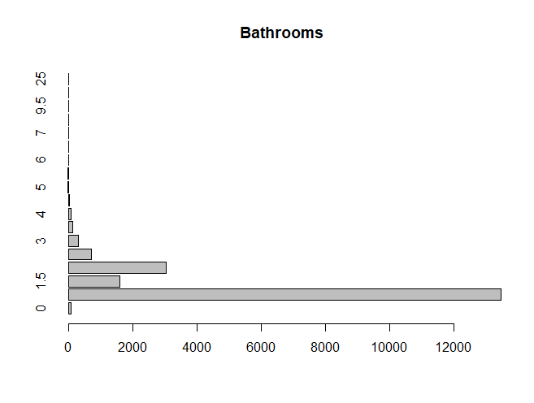
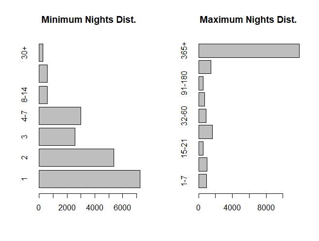
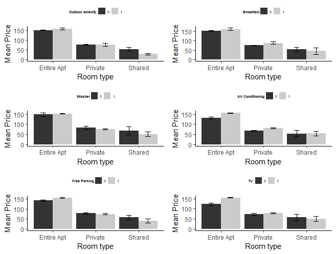

```{r setup, include=FALSE}
knitr::opts_chunk$set(echo = FALSE, message=FALSE, warning=FALSE)
```

```{r, results='hide', message=FALSE, warning=FALSE}
library(knitr)

out <- "/Users/Dominik/OneDrive - Central European University/2nd_trimester/DA3/da3-assignments/da3-assignment1/out/"
```

## [Github Repo](https://github.com/dgulacsy/da3-assignments/tree/main/assignment_1)


# Introduction
In this analysis I am aiming to find a prediction model that can be effectively used to predict the per night price for apartments. The company which would like to use this model to make predictions has apartments with a capacity of 2-6 persons based in Melbourne, Australia. The company would like to use the predictions to decide how they should price their apartments on the online rental marketplace, Airbnb. To come up with a model, I go through all the steps of sample design, label engineering and feature engineering. I look at descriptive statistics to decide what kind of model specifications I should include. I run altogether 8 models with increasing complexity and finally a model using LASSO. I compare and assess model performance and recommend a final model for the prediction problem.

# Data
I build my prediction models using the data acquired from the [Inside Airbnb](http://insideairbnb.com/get-the-data.html) site. This site has data on Airbnb listings in major cities. It includes data on the property's price (for next available spot), location, room type, property type and the amenities provided. In addition, it also includes data related to the host and the listing itself, for example the date of first review, host response rate and so on. As first of my data analysis process, I selected those features/variables from the original that I found relevant to make predictions or  useful to do data cleaning/wrangling. So I started my analysis with the following variables:

```{r, results='asis'}
tmp <- URLencode(paste(readLines(paste0(out,"t_variables.html")), collapse="\n"))

cat('<iframe src="data:text/html;charset=utf-8,', tmp ,
    '" style="border: none; seamless:seamless; width: 800px; height: 200px"></iframe>')
```

# Data Cleaning/Wrangling & EDA  

To clean up the data I got by the first round of feature selection, I looked at how many missing values are in each of the variables. Most of the variables are are readily available. I used an a priori data availability limit of 60% so if a variable consists has more than 40% missing values I drop it. Luckily there is no such variables that would violate this.


I check duplicates as a next step. I use the id variable to filter out listings that appear twice or more in the data. I also double-check the validity of the id with the id number at the end of the listing URL. Fortunately, there are no duplicates in the data so we can be sure that one observation in the corresponds to one unique listing on Airbnb. However, it might happen that a property is listed multiple times on the platform. Taking this into account is far from obvious and out of the scope of this analysis so I assume that every listing corresponds to a unique property.  



Next I do some variable type conversions to ensure everything is interpreted appropriately by the modeling algorithms. I also do groupings on some of the variables that are categorical but have many values. First, I do this for the property type I aggregate the variable so it only has four values: house, apartment, hotel and other. Quite similarly but first taking a look at the distribution of values I do a grouping for the number of bathrooms as well: 0, 1, 1.5, 2, 2.5, 3, 3+. I decided to go this way because 0.5 bath has a special meaning. It usually represents a toilette only bathroom. With feeding the variable to a regression model as numeric we would automatically assume that a higher price associated with one extra full-bath is ought to be half as high than with an extra half-bath.  

To handle better the minimum and maximum number of nights of stay variables, I created groups analogously to the bathrooms variable. It can be seen on the graphs that the number of listings gradually decrease as minimum nights are longer. In case of maximum nights we see something different. It seems like many of the listings is open to long-term rentals. Maybe this shows us that most of the listings suppose to be rented out for a long-term and these properties are not really targeted to short vacation stay but for living in the city more permanently. An other reason may be that it is a default setting in Airbnb or most hosts give a long period just to be sure to appear for visitors more frequently.



I also add some calculated variables. Firstly, I use the latitude and longitude coordinates to estimate the distance from the city center of Melbourne. I display the distance in meters. I use this variables as in general I expect properties to have lower price if they are in suburbs. In addition, I also used the date of first review and date of scrape to calculate the age of the listing. This gives a perspective on the establishment/credibility of the listing. I would expect older listings to be more consistent and reasonably priced than newer ones.   

Finally, I take the list of amenities and extract the distinct values. I create binary indicators to show if an amenity is available at a property. Since there are many different values in the list of amenities I also take the endeavor to group them based on a keyword structure. To establish this structure I look at the most frequent words and I go through the amenities to formulate amenity groups. After grouping I check the frequency of these amenity groups. I drop the groups that are only available at less than 5% of the properties. At last I end up with 30 amenity groups ranging from TV through kitchen supplies to parking.   


## Characteristics of Listings in Melbourne

As I need to predict the price of properties, I remove any listings that have a missing price data. I also look at the histogram of the price to check if there are any extreme values that are likely to be errors. The highest price is 999 AUD. Although it is very high for one night it may be possible that this is a luxury listing so I don't remove any of the observations. Also as it is expected the price seems log-normally distributed so it may worth to redo the analysis using log prices.   


When looking at the differences in price among different room types we can see that listings of entire apartments have a majorly higher price in general than listings of private or shared rooms. However, there are some private rooms which have a particularly high price per night just as high as some of the listings offering entire apartments. Overall it seems like that room type can be a useful variable in predicting price.


The next thing to think about is business logic. The essential point of this analysis is to predict prices. However, data still contains listings that is significantly different from the company's apartments. Therefore I drop those listings where property type is not apartment or the room type is hotel. This concludes all the feature/label engineering and sample design steps now I use the subsequent data to run models on it.

# Model Building

To try to address non-linearity in the data I generate new variables by taking the square and cubic of those variables where I would expect some non-linear pattern of association with price. These variables are the number of days listed (listing age in days), distance from city center and number of accommodates.

I build 8 models by hand with increasing complexity to catch the optimal model that has the right amount of complexity to capture the patterns in the data but not too complex to capture patterns that are not really in the data in a general sense. I start from a simple linear regression using only number of accommodates up to a multiple linear regression model that uses almost all of the variables I prepared and any combination of them as an interaction. The first model is expected to be too simple (underfitting) while the last too complex (overfitting). To build moderately complex but not too simple models I look at conditional distributions of certain variable combinations. 


After looking at many viable combinations I found these 6 the most compelling. It can be seen how the average price difference changes by the room type. So these combinations worth to try in the "in-between" models.

Before running the models I separate 20% of the data to create holdout set. On the remaining work part I run models with five-fold cross-validation.

# Model Performance  

I use RMSE as a loss function. I evaluate the models by taking the simple mean of RMSEs calculated on the test sets at each fold.

```{r, results='asis'}
tmp <- URLencode(paste(readLines(paste0(out,"t_model_performance.html")), collapse="\n"))

cat('<iframe src="data:text/html;charset=utf-8,', tmp ,
    '" style="border: none; seamless:seamless; width: 800px; height: 400px"></iframe>')
```

Based on the results, it can be said that there is not much difference between most of the models. Not surprisingly the Model1 has a relatively large RMSE and Model8 has large RMSE on the test set since the firs underfits the data while the second seriously overfits the data. Using RMSE the best model is Model7 with 70.3. In contrast, using BIC tells that the best model is Model3. Overall there is only a slight difference between models 3-7. Since cross-validated RMSE is more reliable I pick Model 7 to predict prices.   

To make sure that the chosen model is a good choice I also run LASSO regression using the same variables as in Model8. The model estimated by the LASSO regression has a cross-validated RMSE of 70.1. It shrink the model to 159 coefficients. It is almost the same as of Model7 with hand-picked variables. Because the difference so slight I am reassured that Model7 is a good choice. I also choose Model 7 because as I expect a higher external validity for that.

Finally, I assess the usability of this model on the live data by calculating its RMSE on the holdout set. It turns out to be 72.3. This seems reasonable so I accept this model to be used for prediction.
