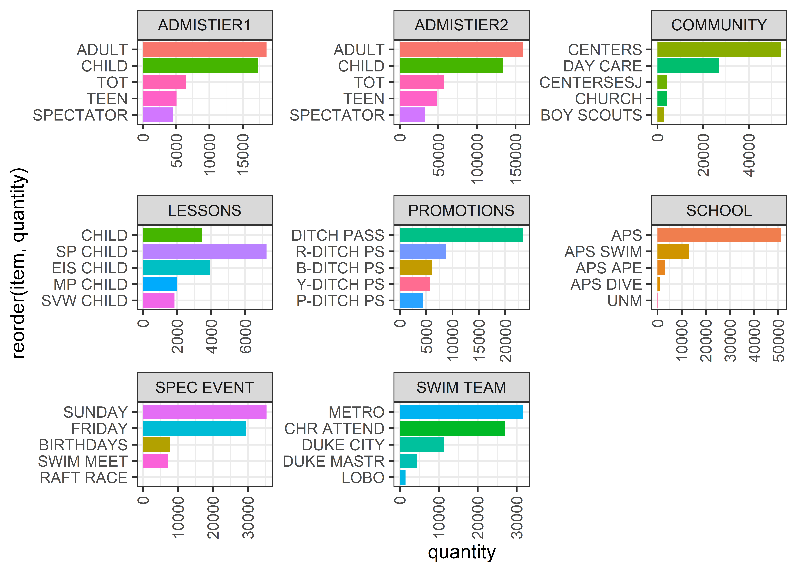

```{r setup, include=FALSE}
knitr::opts_chunk$set(echo = FALSE, message=FALSE, warning=FALSE, cache = T)
```
[Github Repo](https://github.com/dgulacsy/da3-assignments/tree/main/da3-assignment3)

```{r, include=FALSE}
# Initialize environment --------------------------------------------------
# CLEAR MEMORY
rm(list=ls())

# General
library(tidyverse)
library(Hmisc)
# Modeling
library(timeDate)
library(caret)
library(lubridate)
library(prophet)
# Parallel Computation
library(parallel)
library(doParallel)
# Visualization
library(stargazer)
library(scales)
library(ggplot2)
library(cowplot)
library(viridis)
library(party)
library(GGally)
library(pROC)
library(knitr)

source("codes/helper.R")
```

# Introduction
In this analytics exercise I used historical data on swimming pool admissions in the US city of Albuquerque to build a model that can be used to predict daily admission rates 12 months ahead.


# Data Cleaning & Wrangling
As a first step before the analysis I clean the data and add some features. The original data source that I use is a transaction data table which contains admissions into all of Albuquerque's swimming pool. As my goal is to predict the admissions rate for all outdoor swimming pools I visited Albuquerque's [Parks & Recreation Department's site](https://www.cabq.gov/parksandrecreation/recreation/swimming/indoor-pools) to find out which location codes correspond to outdoor swimming pools. I discarded all admissions that were not belonging to any of these swimming pools. I aggregated the remaining observations to a daily level. 




After looking at the data I decided to predict the sum of general admission types like child, teen, adult, senior, child pm etc. However there were some admission types which were also considerable like school-related or lesson-related admissions. I decided to use some of these other kind of admission rates to help give a better estimate for the general, paid admissions consisting of "ADMISTIER1" and "ADMISTIER2" categories.


```{r}
#import data
daily_agg<-read.csv("data/clean/swim_work.csv") %>% 
  mutate(date = as.Date(date))

adm_types<-colnames(daily_agg %>% select(matches("adm_.*")))

# dow: 1=Monday, weekend: Sat and Sun.
daily_agg <- daily_agg %>%
  mutate(year = year(date),
         quarter = quarter(date),
         month = factor(month(date)),
         week= factor(week(date)),
         day = day(date)) %>%
  mutate(dow = factor(wday(date, week_start = getOption("lubridate.week.start", 1)))) %>%
  mutate(weekend = factor(as.integer(dow %in% c(6,7))))

daily_agg <- daily_agg %>% 
  mutate(school_off = ((day>15 & month==5 & day <=30) | (month==6 |  month==7) |
                         (day<15 & month==8) | (day>20 & month==12) ))

daily_agg <- daily_agg %>% 
  mutate(trend = c(1:dim(daily_agg)[1]))

# summary(daily_agg[,adm_types])
```

# Feature Engineering
To predict the admission rates I had to extract some explanatory variables from the dates. Firstly I added the month week and day of the date as factor variables. Then I looked at the date whether it is weekend day or not, plus I also indicated by a factor variable which day of the week the date is. I also added holidays to capture the effect of increased free time to swimming pool ticket sales.   

To use admission rates from other admission categories I created lagged variables and aggregated them to a weekly level to make them more robust.   

```{r}
# Get holiday calendar ----------------------------------

holidays <-  as.Date(holidayNYSE(2010:2017))

daily_agg <- daily_agg %>% 
  mutate(isHoliday = ifelse(date %in% holidays,1,0))

# describe(daily_agg)

# Define vars for analysis ----------------------------------

daily_agg <- daily_agg %>% 
  mutate(adm_core_mod = ifelse(adm_core<1, 1, adm_core),
         ln_adm_core = log(adm_core_mod))

daily_agg <- 
  daily_agg %>% 
  group_by(month) %>% 
  mutate(adm_core_m = mean(adm_core)) %>% 
  ungroup()

adm_types_w<-paste(adm_types,"_w",sep="",collapse =NULL)

daily_agg <- 
  daily_agg %>% 
  group_by(week) %>% 
  mutate_at(vars(adm_types), funs("w"=mean(.))) %>% 
  ungroup() %>% 
  mutate_at(vars(all_of(adm_types_w)), funs("lag"=Lag(.,365)))

daily_agg <- 
  daily_agg %>% 
  group_by(month, dow) %>% 
  mutate(adm_core_md = mean(adm_core),
         ln_adm_core_md = log(adm_core_md)) %>% 
  ungroup()
```

# EDA   
```{r}
################################
# Descriptive graphs ----------
#################################

# named date vars for graphs
mydays <- c("Mon","Tue","Wed",
            "Thu","Fri","Sat",
            "Sun")
daily_agg$dow_abb   <- factor(   mydays[daily_agg$dow],  levels=mydays)
daily_agg$month_abb <- factor(month.abb[daily_agg$month],levels=month.abb)

# Graphs

# Month - year plot
g0<-ggplot(daily_agg,aes(x=year,y=adm_core))+
  geom_bar(aes(fill=adm_core),position="dodge", stat="identity")+
  facet_wrap(. ~ month_abb ,scales = 'free')+
  theme(axis.text.x = element_text(angle = 90, vjust = 0.5, hjust=1),
        legend.position = "none")
g0
# ggsave("out/swimming_pools_month_admissions_core.png", dpi = 1200)

# Admission core 2015
g1 <-ggplot(data=daily_agg[daily_agg$year==2015,], aes(x=date, y=adm_com)) +
  geom_line(size=0.4, color=color[1]) +
  scale_x_date(breaks = as.Date(c("2015-01-01","2015-04-01","2015-07-01","2015-10-01","2016-01-01")),
               labels = date_format("%d%b%Y"),
               date_minor_breaks = "1 month" ) +
  labs(title= "Number of tickets sold in 2015 (Core)", x = "Day", y="Number of tickets sold (Core, Daily)" ) +
  scale_color_discrete(name = "")
g1
# ggsave("out/swimming_pools_2015_admissions_core.png", dpi = 1200)
```

Based on the graphs we can see that ticket sales is not surprisingly is very high during the summer months and quite low in other months. It means that there is high seasonality in the data and it is vital to address this in the analysis. It can be also seen that even during the summer admissions fall to 0 some days which makes it quite clear that the swimming pools close for some days even in the summer season.   

```{r,fig.height=8}
# Admission core 2015 - other admissions 2015
gl<-list()
lags<-colnames(daily_agg %>% select(matches("*._lag")))
names<-c("Community","Lessons","Promotion","School","Spec Event","Swim Team")
daily_agg<-daily_agg %>% 
  mutate_at(vars(all_of(lags)), funs("scaled"=scale(.)))
scaled_vars<-colnames(daily_agg %>% select(matches("*._lag_scaled")))[-1]
for (i in 1:6){
  var<-scaled_vars[i]
  name<-names[i]
  p<-ggplot(data=daily_agg[daily_agg$year==2015,]) +
    geom_line(aes(x=date, y=scale(adm_core), color="purple"),size=1) +
    geom_line(aes_string(x="date", y=var, color=shQuote("orange")),size=1) +
    scale_x_date(breaks = as.Date(c("2015-01-01","2015-04-01","2015-07-01","2015-10-01","2016-01-01")),
                 labels = date_format("%d%b%Y"),
                 date_minor_breaks = "1 month" ) +
    labs(subtitle= paste0("Number of tickets sold in 2015"," (",name,")"), x = "Day", y="# Tickets"," (",names[i],",Daily)" ) +
    scale_color_manual(name="Category", values=c(purple=color[1],orange=color[2]),labels = c("Core", name))+
    theme(legend.position="bottom")
  gl[[i]]<-p
}
gl_grid<-plot_grid(plotlist = gl,nrow = 3,ncol=2)
gl_grid
# ggsave("out/swimming_pools_2015_admissions_others.png", dpi = 1200,width = mywidth, height = 7)
```

I also wanted to look at what kind of association is in the data between different kind of admission types whether one of them can be effectively used to predict general ticket sales. To do this I standardized the categories and looked at their development in 2015. Community, promotion and special event related admissions are more or less follow a similar pattern as general admissions, however  lesson and school and swim related admissions seem quite different from it. We can see the in early September there is a large spike in school and swim related admissions which is likely due to the start of the new school year.   

```{r}
# Admission core 2010-2014
g2<-ggplot(data=daily_agg[(daily_agg$year>=2010) & (daily_agg$year<=2014),], aes(x=date, y=adm_core)) +
  geom_line(size=0.2, color=color[1]) +
  scale_x_date(breaks = as.Date(c("2010-01-01","2011-01-01","2012-01-01","2013-01-01","2014-01-01","2015-01-01")),
               labels = date_format("%d%b%Y"),
               minor_breaks = "3 months") +
  labs(title= "Number of tickets sold 2010-2014 (Core)", x = "Day", y="Number of tickets sold (Core, Daily)" ) +
  scale_color_discrete(name = "")
# g2
# ggsave("out/swimming_pools_2010_2014_admissions_core.png", dpi = 1200)

# Admission core by month discrete
g3<-ggplot(data=daily_agg, aes(x=month_abb, y=adm_core)) +
  labs(title= "Number of tickets sold by month (Core)", x = "Month", y="Number of tickets sold (Core)" ) +
  geom_boxplot(color=color[1],outlier.color = color[4], outlier.alpha = 0.6, outlier.size = 0.6)
# g3
# ggsave("out/swimming_pools_monthly_admissions_core.png", dpi = 1200)

# Admission core by day of the week
g4<-ggplot(data=daily_agg, aes(x=dow_abb, y=adm_core)) +
  labs(title= "Number of tickets sold by day of the week (Core)", x = "Day of the week", y="Number of tickets sold (Core)" ) +
  geom_boxplot(color=color[1],outlier.color = color[4], outlier.alpha = 0.6, outlier.size = 0.4)
g4

# ggsave("out/swimming_pools_dow_admissions_core.png", dpi = 1200)
```

We can also see the pattern in the data that on the weekend generally more people visit the swimming pools.   

```{r}
# Month - day of the week admission core heatmap
# to check for interactions, look at the heatmap
swim_heatmap <- 
  ggplot(daily_agg, aes(x = dow_abb, y = month_abb, fill = adm_core_md)) +
  geom_tile(colour = "white") +
  labs(subtitle="Average ticket sales by day of week and month", x = 'Day of the week', y = 'Month') +
  scale_fill_viridis(alpha = 0.7, begin = 1, end = 0.2, direction = 1, option = "A") +
  theme(legend.position = "right",
        legend.text = element_text(size=6),
        legend.title =element_text(size=6)
  )
swim_heatmap
# ggsave("out/swimming_pools_md_heatmap_admissions_core.png", dpi = 1200)
```

We can see a similar pattern on the heatmap, weekends are generally more popular, June is the busiest month followed by July and Sundays are relatively less busy in June than in other months. This helped greatly to decide what kind of interactions worth considering.   

# Models  

```{r}
#####################################
# PREDICTION  ----------
#####################################

# discard 2010 to use lag variables
daily_agg <- daily_agg %>%
  filter(year!=2010)

# Create train/houldout data
# Last year of data
data_holdout<- daily_agg %>%
  filter(year==2016)

# Rest of data for training
data_train <- daily_agg %>%
  filter(year<2016)

# Prepare for cross-validation
data_train <- data_train %>% 
  rownames_to_column() %>% 
  mutate(rowname = as.integer(rowname))

test_index_list <- data_train %>% 
  split(f = factor(data_train$year)) %>% 
  lapply(FUN = function(x){x$rowname})

train_index_list <- test_index_list %>% 
  lapply(FUN = function(x){setdiff(data_train$rowname, x)})

train_control <- trainControl(
  method = "cv",
  index = train_index_list, #index of train data for each fold
  savePredictions = TRUE
)

# Fit models ---------------------------------------------------------

lags<-c("adm_com_w_lag","adm_less_w_lag","adm_sch_w_lag","adm_spec_w_lag","adm_swim_w_lag")
X1<-paste(c("adm_com_w_lag","adm_less_w_lag","adm_sch_w_lag","adm_spec_w_lag","adm_swim_w_lag"),"month",sep="*")

#Model 1 (Baseline) linear trend + monthly seasonality
model1 <- as.formula(adm_core ~ 1 + trend + month + dow)
reg1 <- train(
  model1,
  method = "lm",
  data = data_train,
  trControl = train_control
)

#Model 2 linear trend + monthly seasonality + days of week  seasonality + holidays + sch*dow
model2 <- as.formula(adm_core ~ 1 + trend + month + dow + isHoliday + school_off*dow)
reg2 <- train(
  model2,
  method = "lm",
  data = data_train,
  trControl = train_control
)

#Model 3 linear trend + monthly seasonality + days of week  seasonality + holidays + other lagged variables + interactions 
model3 <- formula(paste0("adm_core"," ~ ", 
                         paste(c("1","trend", "month", "dow", "isHoliday", "school_off*dow", "weekend*month",lags,X1)
                               ,collapse = " + ")
                         ,collapse = NULL))
reg3 <- train(
  model3,
  method = "lm",
  data = data_train,
  trControl = train_control
)
```
  
To make predictions I build three models. Each one is a multiple linear regression model. They are of increasing complexity. In the first regression I use only the trend, month and day of the week variables to make predictions. This serves as baseline model. Next I complement this model with the variable that captures holidays and I also include an interaction between the school period indicator variable and the day of week factor variable. Finally, I add the lagged admission rates and their interactions with months to arrive at the 3rd model.  

```{r}
# Get CV RMSE ----------------------------------------------

model_names <- c("reg1","reg2","reg3")
rmse_CV <- c()

for (i in model_names) {
  rmse_CV[i]  <- get(i)$results$RMSE
}
rmse_cv_df<-as.data.frame(rmse_CV)
rmse_cv_df$rel_rmse_cv<-rmse_cv_df$rmse_CV/mean(daily_agg$adm_core)
colnames(rmse_cv_df)<-c("Test RMSE CV","Rel. Test RMSE CV")
kable(rmse_cv_df)
```

Looking at test set CV RMSEs the 3rd and most complex model performs the best. It has a much lower cross validated RMSE than the other two. Therefore I pick this model and take it to the holdout to test its usability on the live data. I do this by making predictions for days in 2016 which I separated from the training work set.   


# Conclusion
Running the model on the holdout set I get a cross validated RMSE of 93.44 which is a bit higher than I got for the test sets. Overall, it seems sufficient however the acceptable range of RMSE is very much dependent on the business problem it is applied to. Using this model we would miss the actual general admission rate by 94 on average.   

```{r}
# Evaluate best model on holdout set --------------------------------------------
data_holdout <- data_holdout %>% 
  mutate(y_hat_3 = predict(reg3, newdata = .))

rmse_holdout_best <- RMSE(data_holdout$adm_core, data_holdout$y_hat_3)
rmse_holdout_df<-data.frame(Model="reg3",`Holdout RMSE`=rmse_holdout_best,`Rel. Holdout RMSE`=rmse_holdout_best/mean(daily_agg$adm_core))

kable(rmse_holdout_df)
```
Based on the graphs we can also see that the model makes the largest errors by far in December. Errors are also large in May which is may be due to the instability in weather conditions and the fact that this is when the summer season kicks in and numbers quickly rise so there is a higher chance of making a huge error.

```{r}
# Plot best predictions --------------------------------------------
#graph relative RMSE (on holdout) per month 
rmse_monthly <- data_holdout %>% 
  mutate(month = factor(format(date,"%b"), 
                        levels= unique(format(sort(.$date),"%b")), 
                        ordered=TRUE)) %>% 
  group_by(month) %>% 
  summarise(
    RMSE = RMSE(adm_core, y_hat_3),
    RMSE_norm= RMSE(adm_core, y_hat_3)/mean(adm_core)
  ) 

g_predictions_rmse<- ggplot(rmse_monthly, aes(x = month, y = RMSE_norm)) +
  geom_col(bg=color[1], color=color[1]) +
  labs(title="RMSE by month", x = "Date (month)", y="RMSE (normalized by monthly sales)" )
g_predictions_rmse
ggsave("out/best_model_preds_RMSE_month.png", dpi = 1200)

g_predictions<-
  ggplot(data=data_holdout, aes(x=date, y=adm_core)) +
  geom_line(aes(size="Actual", colour="Actual", linetype = "Actual") ) +
  geom_line(aes(y=y_hat_3, size="Predicted" ,colour="Predicted",  linetype= "Predicted")) +
  scale_y_continuous(expand = c(0,0))+
  scale_x_date(expand=c(0,0), breaks = as.Date(c("2016-01-01","2016-03-01","2016-05-01","2016-07-01","2016-09-01","2016-11-01", "2017-01-01")),
               labels = date_format("%d%b%Y"),
               date_minor_breaks = "1 month" )+
  scale_color_manual(values=color[1:2], name="")+
  scale_size_manual(name="", values=c(0.4,0.7))+
  #scale_linetype_manual(name = "", values=c("solid", "solid")) +
  scale_linetype_manual(name = "", values=c("solid", "twodash")) +
  labs(subtitle="Actual and predicted daily ticket sales (2016)", x = "Date (day)", y="Daily ticket sales" ) +
  #theme(legend.position = "none") +
  #annotate("text", x = as.Date("2016-07-15"), y = 50, label = "Predicted", color=color[2], size=3)+
  #annotate("text", x = as.Date("2016-09-01"), y = 125, label = "Actual", color=color[1], size=3)
  theme(legend.position=c(0.7,0.8),
        legend.direction = "horizontal",
        legend.text = element_text(size = 6),
        legend.key.width = unit(.8, "cm"),
        legend.key.height = unit(.3, "cm")) + 
  guides(linetype = guide_legend(override.aes = list(size = 0.8))
  )
g_predictions
ggsave("out/best_model_preds.png", dpi = 1200)

```
